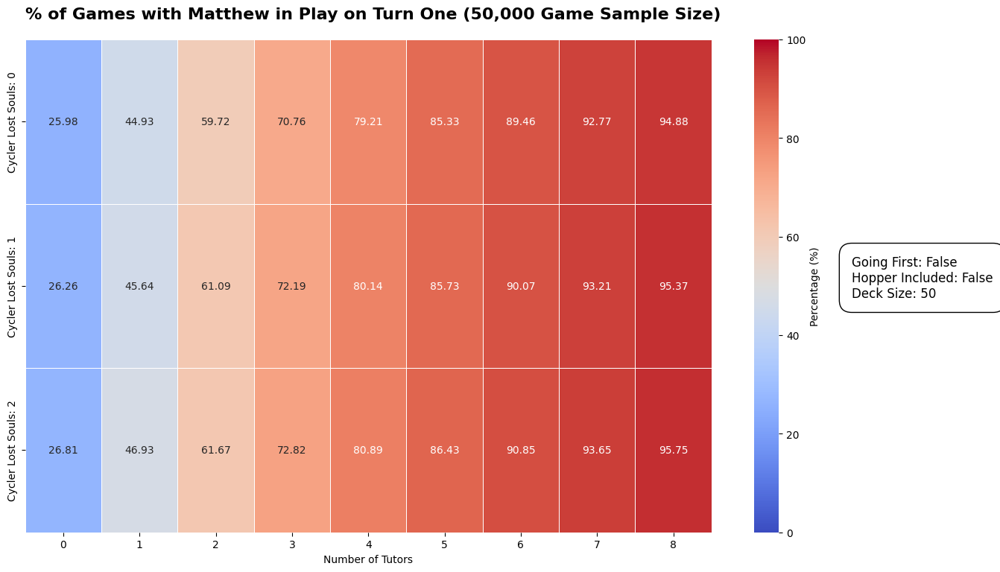

# Redemption Probability Simulation

## Overview
This project is a "Monte Carlo" experiment for the Redemption card game that enables insights about the probabilities of a given event will happen. 

In this first draft, I wanted to see how probable it was to get Matthew into play on turn one. Users can tweak various simulation parameters, such as the number of simulations to run, deck sizes to consider, and specific card inclusions like the hopper lost soul. 

The project supports generating plots of the simulation results, providing visual insights into the outcomes of different configurations.

## Features
- Simulation of Redemption card game scenarios.
- Customizable simulation parameters through command-line arguments.
- Support for generating and saving heatmap plots of the simulation outcomes.
- Configurable deck compositions with options for including specific cards.

## Planned
- More complex interactions (Territory class enhancements, Cards that draw other cards like Denarius)

## Installation
1. Clone this repository to your local machine.

```
git clone https://github.com/timothestes/redemption-probability-simulation.git
```

2. Navigate to the project directory.
```
cd redemption-probability-simulation
```

3. Install the required Python packages.
```
sh config.sh
```

## Usage
To run a simulation, navigate to the project root directory and execute the `main.py` script with the desired parameters. Here are some examples:

```shell
python3 -m src.main \
    --n_simulations 50000 \
    --deck_sizes_to_try 50 \
    --n_cycler_souls_to_try 0 1 2 \
    --going_first \
    --hopper \
    --virgin_birth \
    --generate_plot
```

### Command-Line Arguments
- `--n_simulations`: Number of simulations to run (default: 5000).
- `--n_tutors_to_try`: Space-separated list of tutor counts to try in simulations.
- `--n_cycler_souls_to_try`: Space-separated list of cycler soul counts to try.
- `--deck_sizes_to_try`: Space-separated list of deck sizes to try (not tested for multiple deck sizes yet).
- `--n_turns`: Number of turns per simulation (default: 1, not tested for above one yet).
- `--going_first`: Flag to simulate going first in the game (which means 3 cards will not be drawn at the start of the first turn).
- `--hopper`: Flag to include the hopper card in the deck.
- `--virgin_birth`: Flag to include The Virgin Birth in the deck.
- `--generate_plot`: Flag to generate a heatmap of the simulation's results.

## Plotting Results
If the `--generate_plot` flag is included, the script will generate a heatmap visualizing the percentage of games with the desired outcome based on the simulation parameters. The plot will be saved in the `tmp/` directory.

Here's an example heat map (not going first, no hopper, 50 card deck, and 50,0000 simulations):


## Contributing
Contributions to the Redemption Probability Simulation project are welcome! Please create your branch and make a pull request.

## License
This project is licensed under the [MIT License](LICENSE).